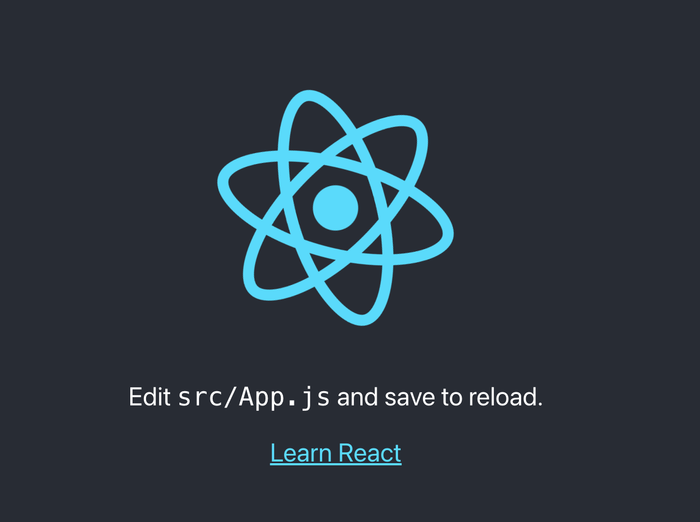

# React の環境構築

## 環境説明

- Node.js v14.17.4
- Yarn v1.22.18
- React/React-DOM v17.0.2
- ESLint v8.15.0
- Prettier v2.6.2（ファイル保存時に自動整形）

## 実行方法

1. GitHub リポジトリから Clone
   ```
   git clone https://github.com/arifuku1028/react-lesson2.git
   ```
2. カレントディレクトリの移動
   ```
   cd react-lesson2/
   ```
3. React 実行
   ```
   yarn start
   ```
4. 実行確認  
   http://localhost:3000  
   以下が表示されれば OK！
   
